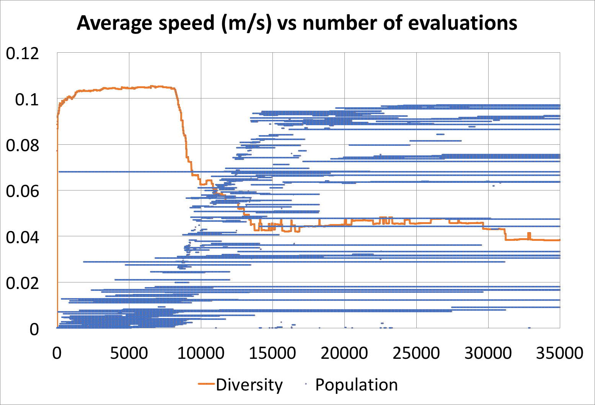

# WalkingRobots

## Gifs

I started by actuating the springs using sine waves

Then, I introduced a neural network to actuate the springs. The network was trained using evolutionary computation, but there were many issues involving "mechanical snaps"

After those issues were resolved, the network started to learn that vibrating was an effective tactic

After adding additional incentives to avoid these "hacky" solutions, the network literally invented the wheel:

## Reports

In order for the computation to learn the best neural network to actuate the springs, I splice and mutate pairs of existing networks in order to "breed" the best offspring. After "breeding", I sort the population and keep only the top scoring members of the population. 

In my first attempt, I simply sort the poulation by the speed they were able to achieve. However, this led to a lack of diversity in the populaiton, and stunted growth. Please note that "diversity" was measured using the average l2 norm of the network weights between pairs of the population, and their values are scaled down arbitrarily to fit into the following graphs. They are important for viewing the diversity trend.

I then tried using both speed and age as simulataneous objective functions, to encourage the survival of innovative new networks. To sort the population by these two objectives, I used the [NSGA-ii](https://pdfs.semanticscholar.org/bcd2/9e88011498519269da020fb91b759f00d701.pdf) sorting algorithm. This approach yielded more diversity and better results overall.

Typically, there would be a sudden "breakthrough" when one network was able to vastly outperform the others. Can you spot when it occurs?

## Coming soon
